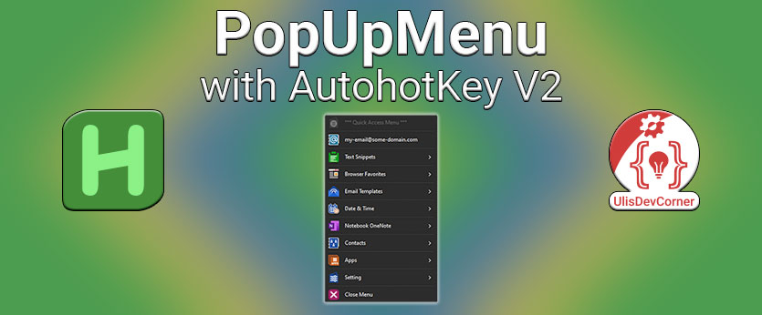

## AutoHotkey Docs
[**URL**: Main Docs](https://www.autohotkey.com/docs/v2/)

#### Requires
Displays an error and quits if a version requirement is not met.  
`#Requires Requirement`  
[**URL**: AHK Docs](https://www.autohotkey.com/docs/v2/lib/_Requires.htm)

#### SingleInstance
Determines whether a script is allowed to run again when it is already running.  
`#SingleInstance ForceIgnorePromptOff`
If omitted, it defaults to Force.
[**URL**: AHK Docs](https://www.autohotkey.com/docs/v2/lib/_SingleInstance.htm)

#### Persistent
Prevents the script from exiting automatically when its last thread completes, allowing it to stay running in an idle state.   
`Persistent`  
[**URL**: AHK Docs](https://www.autohotkey.com/docs/v2/lib/Persistent.htm)

### Tray Menu

#### Tray Icon
By default, each script adds its own icon to the taskbar notification area (commonly known as the tray).  
[**URL**: AHK Docs](https://www.autohotkey.com/docs/v2/Program.htm#tray-icon)

#### Built-in Variables
A number of useful variables are built into the program and can be referenced by any script. Except where noted, these variables are read-only; that is, their contents cannot be directly altered by the script. By convention, most of these variables start with the prefix A_, so it is best to avoid using this prefix for your own variables.
[**URL**: AHK Docs](https://www.autohotkey.com/docs/v2/Concepts.htm#built-in-variables)

#### Script Settings
[**URL**: AHK Docs](https://www.autohotkey.com/docs/v2/Variables.htm#settings)

#### A_TrayMenu
Returns a Menu object which can be used to modify or display the tray menu.

#### Remove default menus
[**URL**: AHK Docs](https://www.autohotkey.com/docs/v1/lib/Menu.htm#Delete)

### Menu/MenuBar Object
[**URL**: AHK Docs](https://www.autohotkey.com/docs/v2/lib/Menu.htm)

```MyCallback(ItemName, ItemPos, MyMenu) {}```
The names given to the parameters do not matter, the following values are sequentially assigned to them:

1. The name of the menu item.
2. The position number of the menu item.
3. The Menu object of the menu to which the menu item was added.

One or more parameters can be omit from the end of the callback's parameter list, but in this case an **asterisk** must be specified as the final parameter. 

#### Example

```MyCallback(Param1, *)```


#### Date and Time
Date and Time build-in variables overview.

[**URL**: AHK Docs](https://www.autohotkey.com/docs/v2/Variables.htm#date)

#### A_Now
The current local time in YYYYMMDDHH24MISS format.

[**URL**: AHK Docs](https://www.autohotkey.com/docs/v2/Variables.htm#Now)

### FormatTime
[**URL**: AHK Docs](https://www.autohotkey.com/docs/v2/lib/FormatTime.htm)

Transforms a YYYYMMDDHH24MISS timestamp into the specified date/time format.
#### Date Formats (case-sensitive)
[**URL**: AHK Docs](https://www.autohotkey.com/docs/v2/lib/FormatTime.htm#Date_Formats)

### GUI
`class Gui extends Object`  
Provides an interface to create a window, add controls, modify the window, and retrieve information about the window. Such windows can be used as data entry forms or custom user interfaces.

[**URL**: AHK Docs](https://www.autohotkey.com/docs/v2/lib/Gui.htm#Call)

#### BackColor
Retrieves or sets the background color of the window.  

`MyGui.BackColor := NewColor`  

[**URL**: AHK Docs](https://www.autohotkey.com/docs/v2/lib/Gui.htm#BackColor)

#### Call
Creates a new window. 

`MyGui := Gui(Options, Title, EventObj)`

[**URL**: AHK Docs](https://www.autohotkey.com/docs/v2/lib/Gui.htm#Call)

#### SetFont
Sets the font typeface, size, style, and/or color for controls added to the window from this point onward.

`MyGui.SetFont(Options, FontName)`

[**URL**: AHK Docs](https://www.autohotkey.com/docs/v2/lib/Gui.htm#SetFont)

#### Add
Creates a new control and adds it to the window.

`GuiCtrl := MyGui.Add(ControlType , Options, Text)`

[**URL**: AHK Docs](https://www.autohotkey.com/docs/v2/lib/Gui.htm#Add)

#### OnEvent
Registers a function or method to be called when the given event is raised.

`MyGui.OnEvent(EventName, Callback [, AddRemove])`  

[**URL**: AHK Docs](https://www.autohotkey.com/docs/v2/lib/GuiOnEvent.htm)

### DllCall
Calls a function inside a DLL, such as a standard Windows API function.  

[**URL**: AHK Docs](https://www.autohotkey.com/docs/v2/lib/DllCall.htm)

#### Win32 API
Sets the value of Desktop Window Manager (DWM) non-client rendering attributes for a window. For programming guidance, and code examples, see Controlling non-client region rendering.  
[**URL**: DwmSetWindowAttribute ](https://learn.microsoft.com/en-us/windows/win32/api/dwmapi/nf-dwmapi-dwmsetwindowattribute)

## Shortcuts
#### Basics
| Key                        | Action                                      |
|----------------------------|---------------------------------------------|
| Ctrl + ,                   | Settings...                                 |
| Ctrl + K, Ctrl + S         | Keyboard Settings...                        |
| Ctrl + Shift + P **or** F1 | Command Palette...                          |

#### Extensions
| Key                        | Action                                      |
|----------------------------|---------------------------------------------|
| Ctrl + Win + Alt + T     | Toggle CamelCase                              |
| Ctrl + Win + Alt + R     | Reload VS Code                                |
| Ctrl + Alt + N           | New File                                      |
| Ctrl + Shift + Alt + N   | New Folder                                    |

#### File
| Key                        | Action                                      |
|----------------------------|---------------------------------------------|
| Ctrl + P                   | Quick Open, Go to File…                     |
| Ctrl + N                   | New File                                    |
| Ctrl + Shift + N           | New Folder                                  |
| F2                         | Rename                                      |
| F12 **or** Ctrl + LClick   | Go to Definition                            | 
| Ctrl + Tab                 | Move between open Files                     |
| Ctrl + PgUp                | Next Editor / Tab                           |
| Ctrl + PgDown              | Previous Editor / Tab                       |
| Ctrl + W                   | Close Active File                           |
| Ctrl + K, W                | Close all Open Files                        |
| Ctrl + K, M                | Select Language Mode                        |
| Ctrl + B                   | Toggle Primary Side Bar                     |

#### Edit
| Key                        | Action                                      |
|----------------------------|---------------------------------------------|
| Ctrl + F                   | Find                                        |
| Ctrl + H                   | Replace                                     |
| Ctrl + R                   | Recent Files                                |
| Ctrl + G                   | Go to Line / Column                         |
| Ctrl + Shift + \           | Go to Bracket                               |
| Ctrl + /                   | Line Comment                                |
| Ctrl + Shift + /*          | Block Comment                               |
| Ctrl + K, Ctrl + Q         | Last Edit Location                          |
| Ctrl + Shift + K           | Delete Line                                 |
| Alt + ↑ / ↓                | Move Line Up / Down                         |
| Shift + Alt + ↓ / ↑        | Copy Line Up / Down                         |
| Shift + F10                | Show Context Actions                        |
| Shift + Alt + F            | Format Code                                 |

#### Cursor
| Key                        | Action                                      |
|----------------------------|---------------------------------------------|
| Alt + LClick               | Insert cursor                               |
| Ctrl + Alt + ↓ / ↑         | Add Cursor Below / Above                    |


#### Selection
| Key                        | Action                                      |
|----------------------------|---------------------------------------------|
| Shift + Alt + → / ←        | Selection Expand  / Shrink                  |
| Alt + D                    | Select Next Occurrence                      |
| Shift + Alt + J            | Unselect Occurrence                         |
| Ctrl + L                   | Select current line                         |
| Ctrl + Shift + L           | Select all occurrences of current selection |
| Ctrl + F2                  | Select all occurrences of current word      |

#### Code Folding
| Key                        | Action                                      |
|----------------------------|---------------------------------------------|
| Ctrl + Shift + [           | Code Folding Collapse                       |
| Ctrl + Shift + [           | Code Folding Expand                         |
| Ctrl + K, Ctrl + 0         | Code Folding Collapse All                   |
| Ctrl + K, Ctrl + J         | Code Folding Expand All                     |

#### View
| Key                        | Action                                      |
|----------------------------|---------------------------------------------|
| Ctrl + Shift + E           | Explorer                                    |
| Ctrl + Shift + F           | Search                                      |
| Ctrl + Shift + G           | Source Control | Git                        |
| Ctrl + Shift + D           | Run                                         |
| Ctrl + Shift + X           | Extensions                                  |

#### Run Scripts
| Key                        | Action                                      |
|----------------------------|---------------------------------------------|
| F5                         | Run Without Debugging                       |
| Ctrl + F5                  | Start Debugging                             |

#### Panel Window
| Key                        | Action                                      |
|----------------------------|---------------------------------------------|
| Ctrl + `                   | Toggle Terminal                             |
| Ctrl + Shift + `           | New Terminal                                |
| Ctrl + Shift + 5           | Split Terminal                              |
| Ctrl + Shift + U           | Toggle Output                               |
| Ctrl + J                   | Toggle Panel Window Visibility              |  

\* Own set Shortcuts

## Extensions
#### AutoHotkey v2 Language Support  
AutoHotkey v2 Language support for VS Code, features realization based on v2 syntax analysis.   
[**URL**: Marketplace](https://marketplace.visualstudio.com/items?itemName=thqby.vscode-autohotkey2-lsp)

#### Create File & Folder : On The Go  
A small extension that help you to create files & folder in Atom Style.
[**URL**: Marketplace](https://marketplace.visualstudio.com/items?itemName=ritwickdey.create-file-folder)

#### Reload VSCode
This extension will add reload button to status bar in the right-bottom of your VSCode editor. This a simple extension, for quickly reload your window, when you have a trouble.. or you want the editor take effect.  
[**URL**: Marketplace](https://marketplace.visualstudio.com/items?itemName=natqe.reload)

#### Camel Case Navigation
This extension provides camel-case navigation to the Visual Studio Code editor.  
[**URL**: Marketplace](https://marketplace.visualstudio.com/items?itemName=maptz.camelcasenavigation)

#### Markdown Preview Enhanced
[**URL**: Marketplace](https://marketplace.visualstudio.com/items?itemName=shd101wyy.markdown-preview-enhanced)